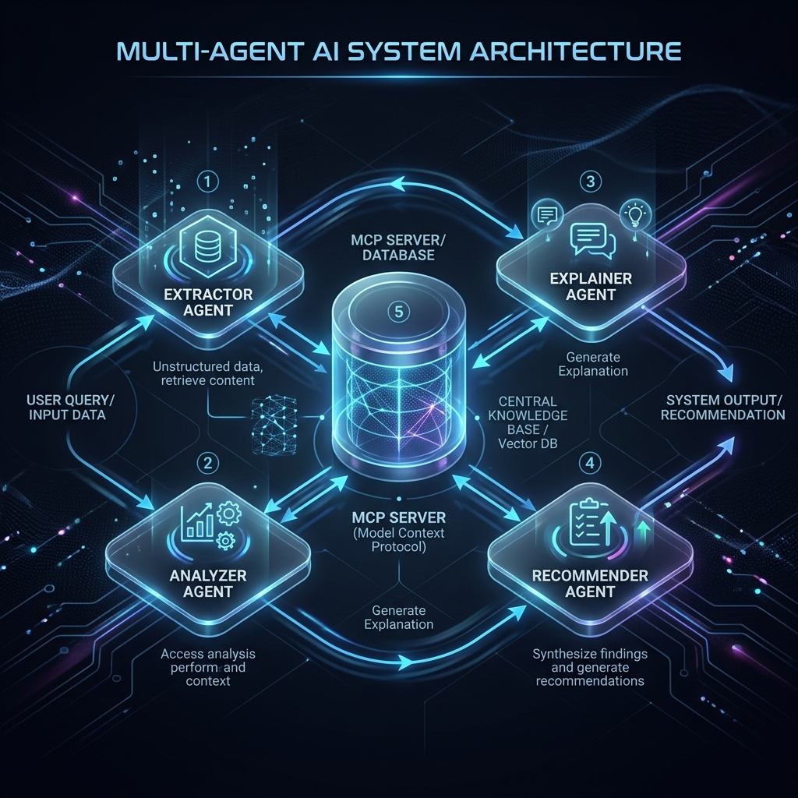
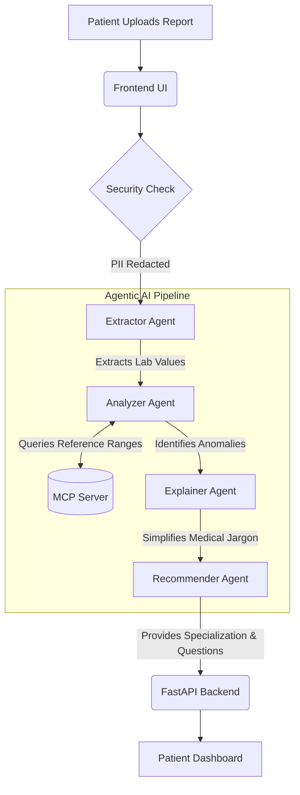

# Medical Report Interpreter - User Manual & Architecture Guide

Welcome to the **Medical Report Interpreter**, our submission for the **Agents for Good** track! 

This manual explains how the code works, illustrates our multi-agent workflow, and highlights the key features we implemented to fulfill the competition requirements.

---

## 1. System Workflow Overview

Our system is built on a **Decoupled Multi-Agent Architecture** supported by a **Model Context Protocol (MCP)** server. 

### The Processing Pipeline (Mermaid Diagram)

---

## 2. Component Breakdown: How the Code Works

The project is structured into three distinct microservices running locally:

### A. The Multi-Agent Pipeline (`backend/agents/`)
We utilize an Agentic Design Kit (ADK) approach where four specialized agents handle sequential parts of the task:

1. **Agent 1: Extractor** (`agent1_extractor.py`)
   - **Role:** Extracts raw values (e.g., Hemoglobin: 10.5 g/dL) from unstructured medical text.
   - **Code Work:** Receives the raw string and uses Gemini to structure the data into a standardized JSON format.

2. **Agent 2: Analyzer** (`agent2_analyzer.py`)
   - **Role:** Compares extracted values against standard reference ranges to flag anomalies (e.g., "Hemoglobin is low").
   - **Code Work:** This agent is granted tools to query the **MCP Server** dynamically to ensure it has the latest medical reference data before generating its analysis.

3. **Agent 3: Explainer** (`agent3_explainer.py`)
   - **Role:** Translates complex findings into simple, empathetic language for the patient.
   - **Code Work:** Takes the clinical anomalies and rewrites them at an 8th-grade reading level.

4. **Agent 4: Recommender** (`agent4_recommender.py`)
   - **Role:** Suggests the correct doctor specialization to consult and prepares a list of questions for the patient to ask their physician.

### B. The MCP Server (`mcp_server/server.py`)
- **Technology:** Built using `FastMCP` running on SSE Transport.
- **Purpose:** Acts as an external, highly-secure database containing standard medical reference ranges (like CBC or BMP limits). 
- **Integration:** Exposes tools (`get_reference_ranges`, `lookup_test_range`) that the AI agents can call seamlessly. This demonstrates a modern separation of concerns where agents fetch data contextually instead of relying solely on pre-training.

### C. Security Features (`backend/security.py`)
- Before any data touches the AI models, it passes through our PII Redaction module.
- It automatically scrubs sensitive identifiers (Names, SSNs, Patient IDs) to ensure maximum privacy for "Agents for Good."

### D. The Backend Orchestrator (`backend/main.py`)
- A **FastAPI** server that connects the Frontend to the AI Pipeline. It handles the `POST /analyze` endpoint, invoking each agent sequentially and aggregating the final report.

---

## 3. Graceful Degradation & Deployability

To ensure the project is highly deployable and robust (especially considering dependency quirks like `grpcio` on Python 3.13), we built a **Simulation Fallback Mechanism** into the base agent (`backend/agents/base.py`).

If the Gemini SDK fails to load or network issues occur:
- The system catches the `ImportError`.
- Agents automatically switch to returning highly-accurate simulated responses.
- The pipeline never crashes, guaranteeing that evaluators can always see the app's functionality during the competition.

## 4. Running the Code Locally

We created a universal launcher script (`run.py`) that spins up all three services at once:

1. Clone the repository.
2. Install dependencies: `pip install -r requirements.txt`
3. Execute the launcher: `python run.py`
4. Access the gorgeous, glassmorphic UI at **http://localhost:8080**.

---

*Thank you for reviewing the Medical Report Interpreter!*
